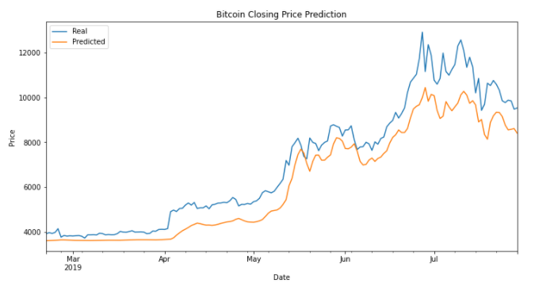
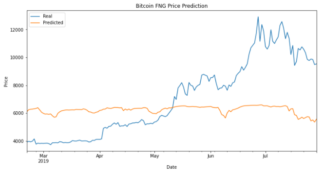

# DeepLearning--LTSM-Stock-Predictor

## Notebooks
[Closing Prices Starter Notebook](Code/lstm_stock_predictor_closing.ipynb)

[FNG Starter Notebook](Code/lstm_stock_predictor_fng.ipynb)

---

## Data Preparation
* Concatenated Fear and Greed Index Values with Bitcoin Close prices
* Created function to slice data by window specified
* Split the dataset, 70% train, 30% test.
* Scaled feature and target variables

---

## Building the LTSM RNN Model
* Specified three LSTM layers, each accompanied by a dropout layer
* Compiled and trained the model with 100 epochs and 1 batch size

---

## Model Performance
* Evaluated the loss metric for each feature (Close price, Fear and Greed Index)
* Used the model to predict prices
* Plotted chart of real vs Predicted Price

---

## Results
BTC Closing Model Prediction             |  BTC FNG Model Prediction
:-------------------------:|:-------------------------:
   |  
